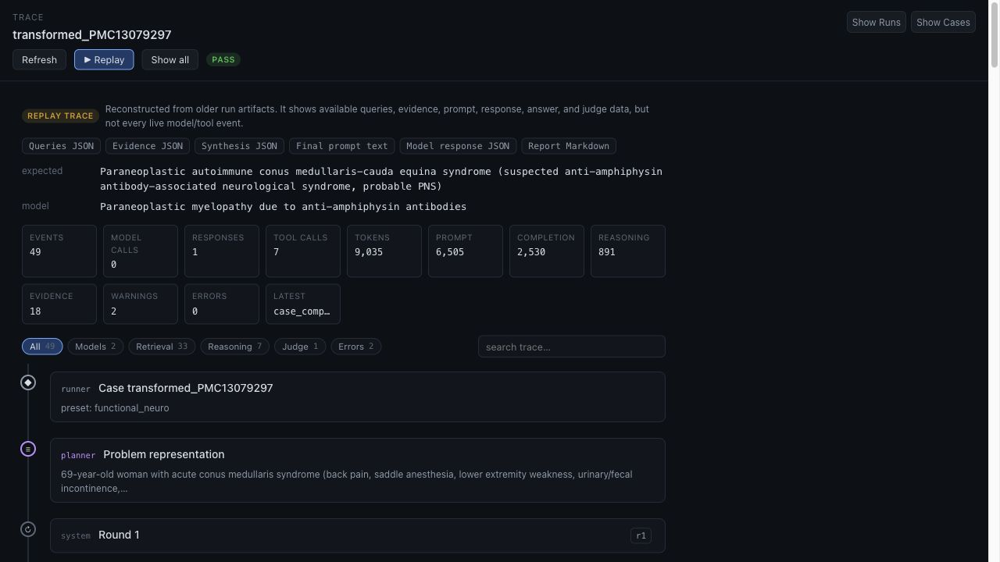
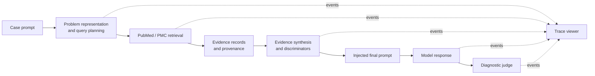

# ClinicalHarness

ClinicalHarness is a research harness for studying how diagnostic reasoning
systems use tools: literature search, retrieval, evidence synthesis, model
calls, and final diagnostic judgement.

It is built for benchmark research and model/tool evaluation, not clinical
decision support.

## Agent-Trace Viewer

ClinicalHarness includes a Codex / Claude-Code-style viewer for replaying a
diagnosis run as an inspectable trace: problem representation, generated
queries, PubMed/PMC tool calls, retrieved evidence, synthesis, injected prompt
packet, visible model responses, final diagnosis, and judge verdict.



What makes it useful:

- **Watch the run unfold.** Replay a finished run event-by-event, or stream live
  events while a run is active.
- **Inspect every layer.** Expand cards for search queries, tool calls,
  evidence, prompt packets, model responses, answer JSON, judge output, and raw
  event payloads.
- **Audit retrieval.** See returned PMIDs/PMCIDs, output evidence IDs,
  full-text snippets, exclusion flags, and source provenance.
- **Track model usage.** Surface latency and token details, including prompt,
  completion, cache, and reasoning-token fields when providers return them.
- **Compare signal quickly.** Trace filters isolate model, retrieval,
  reasoning, judge, warning, and error events.
- **Use the space you need.** Collapsible Runs and Cases panels let the trace
  take over the full window for demos and deep review.

Open the full guide at [viewer/README.md](viewer/README.md).

## Quick Start

Install the Python package:

```bash
python3 -m pip install -e .
```

Run the viewer backend:

```bash
cd viewer/backend
python3 -m venv .venv && . .venv/bin/activate
pip install -e .
python -m clinical_viewer
```

Run the viewer frontend:

```bash
cd viewer/frontend
npm install
npm run dev
```

Open [http://localhost:5173](http://localhost:5173).

## What The Harness Records

Every run is meant to be inspectable after the fact:

- generated search queries and their intent
- PubMed/PMC retrieval calls and returned identifiers
- evidence records with provenance and exclusion metadata
- synthesis/discriminator artifacts across retrieval rounds
- final prompt packets and visible model responses
- structured answers and judge verdicts
- JSONL event ledgers for replay and live streaming

## How It Fits Together



The viewer is intentionally observational: if the UI is unavailable, the run
continues and writes the same artifacts and event ledgers for later replay.

## Documentation

- [Architecture](docs/architecture.md): core objects, retrieval stages, and evaluation modes.
- [Quickstart](docs/quickstart.md): install, test, and run the current PubMed CLI.
- [PubMed Search Guide](docs/pubmed_search.md): practical query patterns for diagnostic case work.
- [Run Provenance](docs/run_provenance.md): what every future run should record for reproducibility.
- [Evaluation Design](docs/evaluation_design.md): closed-book, PubMed-only, open-literature, and web-enabled modes.
- [Source And Licensing Policy](docs/source_and_licensing.md): boundaries for benchmarking, public release, and training.
- [ClinicalHarness Viewer](viewer/README.md): UI guide, local run instructions, API surface, and live ingest notes.
- [Design Decisions](docs/DESIGN_DECISIONS.md): implementation decisions and rationale.
- [Scaled Retrieval Design](docs/scaled_retrieval_design_20260614.md): context-isolated per-paper extraction.
- [Multi-Agent Diagnostic Ensemble Design](docs/multi_agent_design_20260614.md): independent angle-agents plus consolidating coordinator.
- [Roadmap](docs/roadmap.md): staged implementation plan.

## First Slice: PubMed And PMC Retrieval

The initial implementation wraps NCBI E-Utilities for PubMed and PMC:

- `ESearch` for PMID discovery
- `EFetch` for article titles and abstracts
- `ESearch` for PMCID discovery
- `EFetch` for PMC JATS XML and full-text sections
- structured JSON output for downstream evidence synthesis

Set a contact email before doing nontrivial runs:

```bash
export NCBI_EMAIL="you@example.com"
```

Install locally:

```bash
python3 -m pip install -e .
```

Search PubMed:

```bash
clinical-harness pubmed search "autoimmune encephalitis psychosis catatonia" --limit 10
```

Return JSON:

```bash
clinical-harness pubmed search "MOGAD seizure case report" --limit 5 --format json
```

Search PMC full text:

```bash
clinical-harness pmc search "seronegative autoimmune encephalitis criteria" --limit 3
```

Fetch PMC full text by PMCID:

```bash
clinical-harness pmc fetch PMC3122590 --format json
```

If the local Python certificate store is broken, there is an explicit local-only escape hatch:

```bash
clinical-harness pubmed search "anti NMDA receptor encephalitis case report" --limit 5 --insecure
```

Do not use `--insecure` in production runs.

## Single Case Runner

The first diagnosis-attempt slice can load a case JSON file, create a run directory, generate deterministic PubMed queries, optionally retrieve PubMed abstracts, and write a placeholder structured answer.

Run without external retrieval:

```bash
clinical-harness case run examples/cases/synthetic_neuro_case.json \
  --mode pubmed_only \
  --no-retrieve \
  --out runs
```

Run with PubMed retrieval:

```bash
clinical-harness case run examples/cases/synthetic_neuro_case.json \
  --mode pubmed_only \
  --email you@example.com \
  --limit 5 \
  --out runs
```

Each run writes:

- `manifest.json`
- `events.jsonl`
- `queries.jsonl`
- `evidence.jsonl`
- `answer.json`

Use `--mode pubmed_only_source_excluded` to exclude PubMed records matching source identifiers declared in case metadata.

## Intended Architecture

The project will grow into a staged reasoning pipeline:

1. Ingest a hard case prompt.
2. Generate search queries from the clinical problem representation.
3. Search PubMed and other allowed sources.
4. Fetch abstracts/full text where permitted.
5. Extract evidence into structured candidate diagnoses.
6. Ask LLMs to produce differentials, localization, next tests, and final diagnosis.
7. Score outputs against benchmark answer keys.

The first version implements step 3 and PubMed/PMC retrieval for step 4, but evidence synthesis is still a placeholder.

## Example Clinical Query Patterns

High-signal PubMed queries often combine syndrome, tempo, distinctive finding, and case-report terms:

```bash
clinical-harness pubmed search \
  "(autoimmune encephalitis) AND psychosis AND catatonia AND case report" \
  --limit 10
```

```bash
clinical-harness pubmed search \
  "(MOGAD OR \"myelin oligodendrocyte\") AND seizure AND adolescent AND case report" \
  --limit 10 --format json
```

## Licensing And Source Rules

- PubMed metadata and abstracts are not automatically training data.
- For public benchmark release or training data, use source-specific licensing and permissions.
- Store provenance for every retrieved item: API, query, PMID, DOI, publication type, journal, date, and URL.

## Development

Run tests:

```bash
PYTHONPATH=src python3 -m unittest discover -s tests -v
```

The package currently has no runtime dependencies outside the Python standard library.
