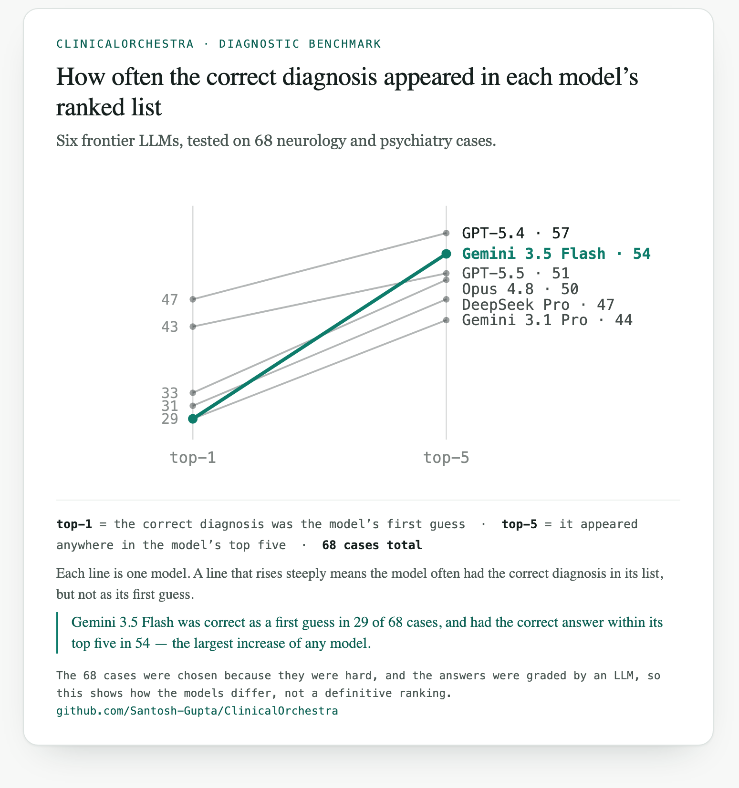
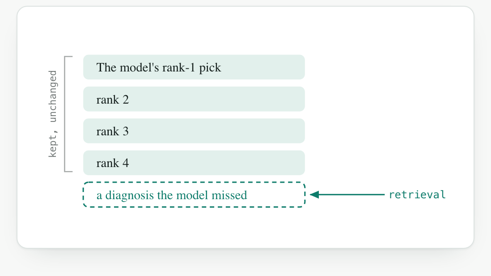
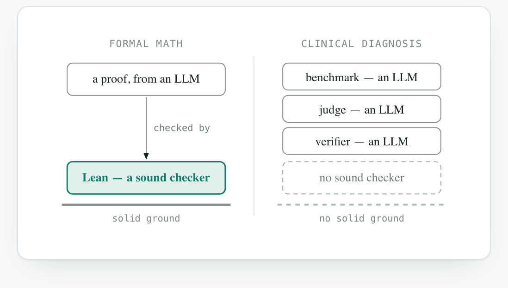
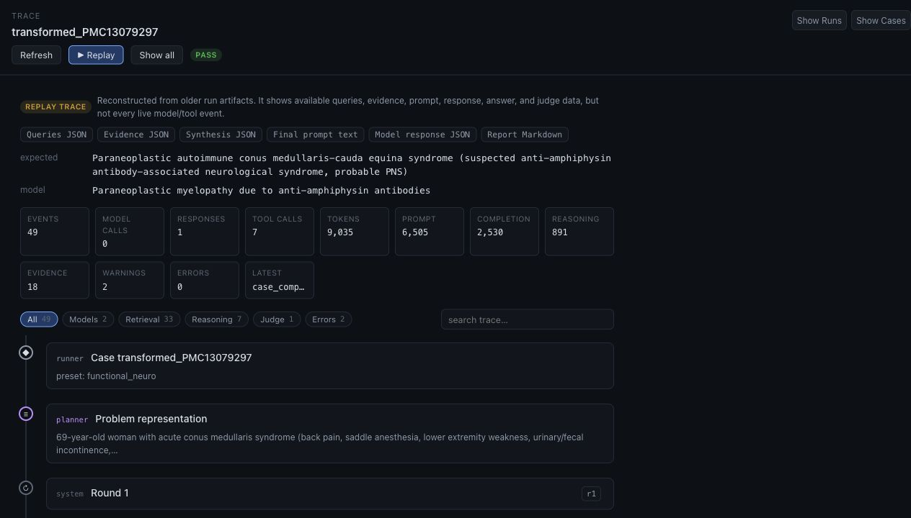
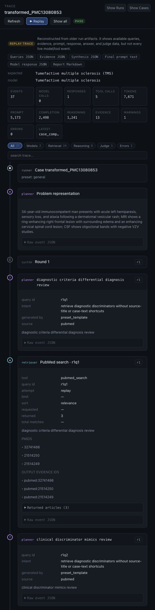
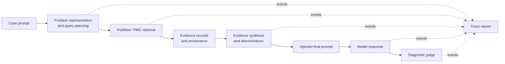

# ClinicalHarness

ClinicalHarness is the code and data behind the write-up
[**"My [failed] Attempt at making a Medical Diagnostic LLM Harness and Benchmark"**](https://santoshguptaml.substack.com/p/my-failed-attempt-at-making-a-medical)
— an exploratory, paused project that tried to build two things:

- an **open-ended diagnostic benchmark** built from neurology and psychiatry case reports published after the
  tested models' training cutoff, and
- a **retrieval harness** meant to improve a model's ranked differential by grounding it in the literature.

Neither fully worked, but the attempt turned up some interesting results and a lot of lessons. It is built for
benchmark research and model/tool evaluation, **not clinical decision support**.



> **Status: exploratory, paused.** The 68-case set was hand-picked to be hard — cases DeepSeek V4 Flash got
> wrong — so it shows how models differ, not a definitive ranking, and the numbers are already dated by newer
> model releases. **➡️ Read the full write-up [on Substack](https://santoshguptaml.substack.com/p/my-failed-attempt-at-making-a-medical)**
> (or [`docs/writeup.md`](docs/writeup.md) in this repo). If the open problems interest you, please reach out —
> collaborators welcome.

## What's interesting

Full detail in the [write-up](https://santoshguptaml.substack.com/p/my-failed-attempt-at-making-a-medical).

**1. The correct diagnosis is often in a model's list, just not first.** Scoring the whole top-5 ranked list
instead of only the first guess reshuffles the models — Gemini 3.5 Flash goes from near-last at top-1 to second
by top-5 (see the chart above).

**2. Bolting on retrieval hurt.** Feeding the model a retrieval-built differential lowered accuracy. The only
safe gain came from keeping the model's own top four and letting retrieval touch just the fifth slot.



**3. A checker that shares the model's blind spots can't fix it.** A verify-and-edit harness couldn't reliably
beat the plain model, because clinical evidence is defeasible — there is no sound checker (like Lean in formal
math) underneath.



## Benchmark: Neurology & Psychiatry ranked-differential dataset

The contamination-reduced 68-case stress set from the exploratory write-up lives at
[`benchmark/neuro_psych_68_challenges.jsonl`](benchmark/neuro_psych_68_challenges.jsonl) — one redacted
diagnostic challenge per line, each with a gold diagnosis and source provenance (PMCID/DOI), derived from
strictly CC-BY case reports published after a conservative cutoff gate. The set was selected from cases that
DeepSeek V4 Flash failed closed-book, so it supports rescue/error analysis rather than a neutral model
leaderboard; the date gate reduces but cannot prove the absence of training contamination. See
[`benchmark/README.md`](benchmark/README.md) for the field format and
[`docs/technical_report/`](docs/technical_report/) for the archived technical report draft with fuller methods and
cross-model results.

An additional **358 development cases** used to build and tune the harness are released at
[`benchmark/development_cases_359.jsonl`](benchmark/development_cases_359.jsonl) for transparency and reuse.
**Disclaimer:** these are *not* the evaluation benchmark — unlike the 68-case set they were not uniformly
proofread, source-mended, or contamination-filtered, and some are flagged unsolvable. Each carries a
`review_status`; see [`benchmark/README.md`](benchmark/README.md) before using them.

## Agent-Trace Viewer

ClinicalHarness includes a Codex / Claude-Code-style viewer for replaying or
watching a diagnosis run as an inspectable trace: problem representation,
generated queries, PubMed/PMC tool calls, retrieved evidence, synthesis,
injected prompt packet, visible model responses, final diagnosis, and, when a
correct answer is provided, judge verdict.

<a href="viewer/assets/clinical-viewer-trace.jpg">
  
</a>

<sub>Click the screenshot to view it full size.</sub>

<details>
<summary>Detailed trace screenshot with expanded cards</summary>

<a href="viewer/assets/clinical-viewer-trace-tall.jpg">
  
</a>

</details>

What makes it useful:

- **Watch the run unfold.** Replay a finished run event-by-event, or stream live
  events while a run is active.
- **Try a brand-new case.** Use **New Case** in the public demo, or **New** in
  the advanced viewer, to enter a de-identified case and create a
  viewer-generated run under `viewer/user_generated/`.
- **Show the full pipeline.** Public model runs use a showcase trace profile
  with evidence distillation, bounded multi-round retrieval, PMC full-text
  enrichment, and per-paper screening, while benchmark runs can keep leaner
  accuracy-oriented settings.
- **Inspect every layer.** Expand cards for search queries, tool calls,
  evidence, prompt packets, model responses, answer JSON, judge output, and raw
  event payloads.
- **Audit retrieval.** See returned PMIDs/PMCIDs, output evidence IDs,
  full-text snippets, exclusion flags, and source provenance.
- **Track model usage.** Surface latency and token details, including prompt,
  completion, cache, and reasoning-token fields when providers return them.
- **Compare signal quickly.** Trace filters isolate model, retrieval,
  reasoning, judge, warning, and error events. The public demo splits the
  trace into retrieval and reasoning lanes so visitors can see search activity
  separately from the diagnostic thread.
- **Use the space you need.** The advanced UI has collapsible Runs and Cases
  panels; the public UI removes those side panels entirely and starts from a
  focused New Case workflow.
- **Save optimization-ready traces.** Persist a user-generated `trace.json` and
  `trace.md` bundle with events, artifacts, model answer, score, and the correct
  answer when available.

Open the full guide at [viewer/README.md](viewer/README.md).

For a public demo, deploy the included root `Dockerfile` or Render Blueprint
(`render.yaml`). The container serves the viewer UI and API from one FastAPI
service. The Docker build compiles the public viewer edition; the Render
environment controls whether public submissions may call PubMed and model APIs.

## Quick Start

Install the Python package:

```bash
python3.11 -m pip install -e .
```

Run the viewer backend:

```bash
cd viewer/backend
python3.11 -m venv .venv && . .venv/bin/activate
pip install -e .
python -m clinical_viewer
```

Run the viewer frontend:

```bash
cd viewer/frontend
npm install
npm run dev
```

Open [http://localhost:5173](http://localhost:5173).

## What The Harness Records

Every run is meant to be inspectable after the fact:

- generated search queries and their intent
- PubMed/PMC retrieval calls and returned identifiers
- evidence records with provenance and exclusion metadata
- synthesis/discriminator artifacts across retrieval rounds
- final prompt packets and visible model responses
- structured answers and judge verdicts
- JSONL event ledgers for replay and live streaming

## How It Fits Together


```mermaid
flowchart LR
  case["Case prompt"] --> planner["Problem representation\nand query planning"]
  planner --> retrieval["PubMed / PMC retrieval"]
  retrieval --> evidence["Evidence records\nand provenance"]
  evidence --> synthesis["Evidence synthesis\nand discriminators"]
  synthesis --> prompt["Injected final prompt"]
  prompt --> model["Model response"]
  model --> judge["Diagnostic judge"]
  planner -. events .-> viewer["Trace viewer"]
  retrieval -. events .-> viewer
  synthesis -. events .-> viewer
  model -. events .-> viewer
  judge -. events .-> viewer
```

The viewer is intentionally observational: if the UI is unavailable, the run
continues and writes the same artifacts and event ledgers for later replay.

## Documentation

- **[Write-up](docs/writeup.md): start here** — the honest project summary: the interesting findings, the
  harness-development failures, why it is paused rather than a paper, and the open problems worth taking
  further.
- **[Project Pause Note](docs/PROJECT_PAUSE_20260831.md): current status** — why the technical-report path is paused,
  what is safe to claim publicly, and what would be required to revive the technical report.
- [Archived technical report draft](docs/technical_report/): full methods and cross-model results retained for
  transparency; the current public-facing deliverable is the write-up, not a submission paper.
- **[Operator Runbook](docs/OPERATOR_RUNBOOK.md): to run the harness on new cases** — env setup, validating a
  new batch, the 3-stage eval protocol (commands), and analyzing outputs (pass@k, gold_rank, failure triage).
- **[AGENTS.md](AGENTS.md): read before changing anything** — the decision-trail rules across agents.
- [Architecture](docs/architecture.md): core objects, retrieval stages, and evaluation modes.
- [Quickstart](docs/quickstart.md): install, test, and run the current PubMed CLI.
- [PubMed Search Guide](docs/pubmed_search.md): practical query patterns for diagnostic case work.
- [Run Provenance](docs/run_provenance.md): what every future run should record for reproducibility.
- [Evaluation Design](docs/evaluation_design.md): closed-book, PubMed-only, open-literature, and web-enabled modes.
- [Source And Licensing Policy](docs/source_and_licensing.md): boundaries for benchmarking, public release, and training.
- [ClinicalHarness Viewer](viewer/README.md): UI guide, local run instructions, API surface, and live ingest notes.
- [Viewer Review Handoff](viewer/REVIEW_HANDOFF.md): checklist for external LLM/code review of the hosted viewer.
- [Design Decisions](docs/DESIGN_DECISIONS.md): implementation decisions and rationale.
- [Scaled Retrieval Design](docs/scaled_retrieval_design_20260614.md): context-isolated per-paper extraction.
- [Multi-Agent Diagnostic Ensemble Design](docs/multi_agent_design_20260614.md): independent angle-agents plus consolidating coordinator.
- [Roadmap](docs/roadmap.md): staged implementation plan.

## First Slice: PubMed And PMC Retrieval

The initial implementation wraps NCBI E-Utilities for PubMed and PMC:

- `ESearch` for PMID discovery
- `EFetch` for article titles and abstracts
- `ESearch` for PMCID discovery
- `EFetch` for PMC JATS XML and full-text sections
- structured JSON output for downstream evidence synthesis

Set a contact email before doing nontrivial runs:

```bash
export NCBI_EMAIL="you@example.com"
```

Install locally:

```bash
python3.11 -m pip install -e .
```

Search PubMed:

```bash
clinical-harness pubmed search "autoimmune encephalitis psychosis catatonia" --limit 10
```

Return JSON:

```bash
clinical-harness pubmed search "MOGAD seizure case report" --limit 5 --format json
```

Search PMC full text:

```bash
clinical-harness pmc search "seronegative autoimmune encephalitis criteria" --limit 3
```

Fetch PMC full text by PMCID:

```bash
clinical-harness pmc fetch PMC3122590 --format json
```

If the local Python certificate store is broken, there is an explicit local-only escape hatch:

```bash
clinical-harness pubmed search "anti NMDA receptor encephalitis case report" --limit 5 --insecure
```

Do not use `--insecure` in production runs.

## Single Case Runner

The first diagnosis-attempt slice can load a case JSON file, create a run directory, generate deterministic PubMed queries, optionally retrieve PubMed abstracts, and write a placeholder structured answer.

Run without external retrieval:

```bash
clinical-harness case run examples/cases/synthetic_neuro_case.json \
  --mode pubmed_only \
  --no-retrieve \
  --out runs
```

Run with PubMed retrieval:

```bash
clinical-harness case run examples/cases/synthetic_neuro_case.json \
  --mode pubmed_only \
  --email you@example.com \
  --limit 5 \
  --out runs
```

Each run writes:

- `manifest.json`
- `events.jsonl`
- `queries.jsonl`
- `evidence.jsonl`
- `answer.json`

Use `--mode pubmed_only_source_excluded` to exclude PubMed records matching source identifiers declared in case metadata.

## Intended Architecture

The project will grow into a staged reasoning pipeline:

1. Ingest a hard case prompt.
2. Generate search queries from the clinical problem representation.
3. Search PubMed and other allowed sources.
4. Fetch abstracts/full text where permitted.
5. Extract evidence into structured candidate diagnoses.
6. Ask LLMs to produce differentials, localization, next tests, and final diagnosis.
7. Score outputs against benchmark answer keys.

The first version implements step 3 and PubMed/PMC retrieval for step 4, but evidence synthesis is still a placeholder.

## Example Clinical Query Patterns

High-signal PubMed queries often combine syndrome, tempo, distinctive finding, and case-report terms:

```bash
clinical-harness pubmed search \
  "(autoimmune encephalitis) AND psychosis AND catatonia AND case report" \
  --limit 10
```

```bash
clinical-harness pubmed search \
  "(MOGAD OR \"myelin oligodendrocyte\") AND seizure AND adolescent AND case report" \
  --limit 10 --format json
```

## Licensing And Source Rules

- PubMed metadata and abstracts are not automatically training data.
- For public benchmark release or training data, use source-specific licensing and permissions.
- Store provenance for every retrieved item: API, query, PMID, DOI, publication type, journal, date, and URL.

## Development

Run tests:

```bash
PYTHONPATH=src python3.11 -m unittest discover -s tests -v
```

The package currently has no runtime dependencies outside the Python standard library.
