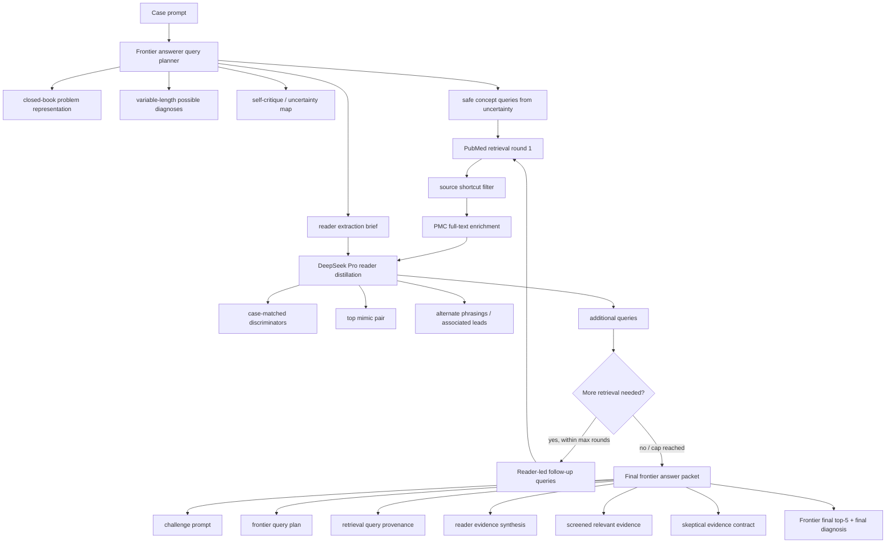

# Frontier-Led Harness Mode

Date: 2026-06-25

Purpose: fix the frontier-model regression pattern where deterministic DeepSeek-derived first queries and hard preset steering pulled strong answerers away from correct bare diagnoses.

## What Changed

The production retrieval-guided evaluator now has an opt-in frontier mode:

- the frontier answerer first writes a closed-book diagnostic state before any retrieval planning
- the initial diagnostic state uses a variable-length `possible_diagnoses` list, not an early top-5
- the final answerer can generate the round-1 retrieval plan before PubMed search
- that plan includes a problem representation, initial differential, uncertainty map, query ideas, and a `reader_extraction_brief`
- unsafe query ideas are filtered against source title/DOI/PMCID/exact-prompt shortcut risks
- deterministic queries are used only as fallback/fill when enabled
- DeepSeek Pro reader receives the frontier extraction brief during evidence distillation and paper extraction
- final prompts include `frontier_query_plan`, `retrieval_queries`, and evidence `query_provenance`
- reader and final prompts include a skeptical evidence contract when frontier mode is enabled

This keeps the existing harness behavior as the default. Frontier mode is opt-in.

## Current Flow



## Where Each Model Is Used

Frontier answerer:

- closed-book diagnostic state before retrieval
- variable-length possible diagnosis set
- initial query planning
- uncertainty map
- reader extraction brief
- final diagnosis and top-5 ranking

DeepSeek Pro reader:

- evidence distillation
- per-paper extraction when `use_paper_extractor=True`
- synonym / associated-entity / literature-led follow-up query suggestions after reading retrieved papers

Deterministic code:

- anti-cheat query filtering
- source article exclusion
- PubMed/PMC retrieval
- optional fallback queries
- result artifact writing/scoring

## Skeptical Evidence Contract

When enabled, reader and final prompts explicitly say that retrieved papers, reader summaries, preset checklists, finalization gates, rare-entity cards, and paper extracts are noisy leads. They may change the differential only when tied to concrete case facts, discriminators, or direct refutation of the current lead.

This is intended to reduce:

- CVST-style preset over-correction
- malignant-catatonia / organic-mimic over-escalation
- unsupported organism/subtype/gene specificity
- generic review evidence displacing a correct bare answer

## Code Entry Points

- Config: `HarnessConfig.use_answerer_query_planner`, `answerer_query_fallback`, `skeptical_evidence_mode`
- Planner: `generate_frontier_query_plan`
- Query conversion: `retrieval_queries_from_frontier_plan`
- Reader prompt: `build_evidence_distillation_prompt(..., query_plan=...)`
- Final prompt: `build_retrieval_guided_final_prompt(..., queries=..., query_plan=...)`
- Cross-model runner env: `HARNESS_FRONTIER_MODE=1`
- CLI: `clinical-harness benchmark retrieval-guided-eval --frontier-mode`

## Gemini 3.5 Flash Test Command

Use the audit-cleaned 68-case manifest for apples-to-apples comparison with the current paper table.

```bash
cd /Users/santoshg/Coding/ClinicalHarness
HARNESS_FRONTIER_MODE=1 \
HARNESS_MAX_ROUNDS=3 \
HARNESS_MIN_ROUNDS=2 \
HARNESS_MAX_QUERIES=4 \
PYTHONPATH=src \
python3.11 scripts/crossmodel_harness.py \
  gemini-3.5-flash v4-pro \
  data/eval/crossmodel/flash_fail_postcutoff.jsonl \
  data/eval/crossmodel_harness_frontier/gemini-3.5-flash__reader_v4-pro_frontier
```

Recommended first comparison:

- baseline current harness: `data/eval/crossmodel_harness/gemini-3.5-flash__reader_v4-pro/retrieval_guided_results.jsonl`
- frontier mode: `data/eval/crossmodel_harness_frontier/gemini-3.5-flash__reader_v4-pro_frontier/retrieval_guided_results.jsonl`

Primary metrics:

- harness top-1
- harness top-5
- bare-pass preservation
- bare-pass demoted to ranks 2-5
- bare-pass lost from top-5
- bare-fail rescued to rank 1
- bare-fail rescued to ranks 2-5

## A/B Hypotheses

Expected improvement:

- fewer bare-correct frontier answers lost or demoted by biased preset retrieval
- better first-query relevance on cases where deterministic templates are too narrow or overfit
- better reader extraction because DeepSeek Pro knows what the frontier model wanted from the papers

Possible risks:

- frontier-generated queries may be too broad or too close to case text, though anti-cheat filters should catch obvious shortcuts
- Gemini 3.5 Flash may generate weaker query plans than stronger frontier models
- more rounds increase cost and may add distracting evidence unless the skeptical contract works

If frontier mode improves top-5 but not top-1, the next needed layer is bare-answer preservation / conservative final reranking.

## First Gemini 3.5 Flash Run

Run directory:

`data/eval/crossmodel_harness_frontier/gemini-3.5-flash__reader_v4-pro_frontier_v2`

Command settings:

- answerer: `gemini-3.5-flash`
- reader: `deepseek-v4-pro`
- `HARNESS_FRONTIER_MODE=1`
- `HARNESS_MAX_ROUNDS=3`
- `HARNESS_MIN_ROUNDS=2`
- `HARNESS_MAX_QUERIES=4`
- `HARNESS_CONCURRENCY=4`
- local TLS workaround: `MODEL_VERIFY_TLS=0`, `NCBI_VERIFY_TLS=0`

Result on the 68-case post-audit manifest:

| Run | Top-1 | Top-5 |
|---|---:|---:|
| Existing Gemini 3.5 Flash harness file | 27/68 | 47/68 |
| Frontier mode v2 | 28/68 | 41/68 |

Direct old-vs-frontier flips:

- top-1 gains: 8 cases
- top-1 regressions: 7 cases
- top-5 gains: 7 cases
- top-5 regressions: 13 cases

Interpretation: frontier-led first queries fixed one major architectural problem, and slightly improved top-1 in this run, but it did not make the harness safe for frontier models. Top-5 recall worsened materially. This suggests that the remaining bottleneck is not only query planning; the evidence pipeline and final chooser still lose or demote useful candidates.

Immediate next design priorities:

1. Bare-answer preservation prior: keep the bare frontier answer at rank 1 unless retrieved evidence directly refutes it with a case-matched discriminator.
2. Evidence-quality gate: reader extracts should be allowed to move rank only when tied to a concrete case fact.
3. Candidate-pool separation: retrieval should generate candidates; a separate conservative chooser should rank them.
4. Reader JSON robustness: DeepSeek Pro evidence distillation sometimes fails JSON and falls back deterministically, which can reduce the benefit of frontier-led planning.
5. Top-5 preservation: frontier mode must avoid losing candidates the old harness had in top-5.

## 2026-06-25 Planner Refinement

Lesson: the earlier frontier mode still underestimated the answerer. Even though the frontier answerer generated queries, it was asked to plan retrieval too soon. The first thing a strong model should do is use its own weights fully.

The planner prompt now enforces this order:

1. Closed-book diagnostic state from the case alone.
2. Variable-length `possible_diagnoses`, not a fixed top-5.
3. Self-critique: what is uncertain, what might be outside the model's weights, and what discriminators would change the differential.
4. Query ideas generated only from those uncertainty gaps.

Only the final diagnostic call should produce the scored top-5. Query planning is now explicitly an exploration task, not an early ranking task.

## 2026-06-25 v3 Preservation Pass

The v2 run still allowed deterministic fallback queries to fill unused frontier-query slots. That reintroduced
the original failure mode: generic preset/template searches could bias the evidence packet before the final
answerer ranked candidates.

Changes implemented:

- Frontier mode now defaults to `answerer_query_fallback=False` in `scripts/crossmodel_harness.py`.
- The CLI keeps deterministic fallback available only when explicitly requested with `--answerer-query-fallback`
  in `--frontier-mode`.
- If the frontier planner produces no safe round-1 query and fallback is disabled, the harness skips deterministic
  template retrieval rather than silently injecting generic searches.
- `HarnessConfig.use_bare_answer_preservation` carries a `closed_book_diagnostic_prior` into the final prompt.
- The final prompt adds a `CLOSED-BOOK PRIOR PRESERVATION` contract: retrieval is candidate expansion and
  discriminator testing; it must not erase high/medium closed-book candidates unless case-matched evidence directly
  refutes them.
- The final JSON schema now includes `closed_book_prior_audit` so omitted/demoted prior candidates are traceable.
- Compact final-answer retries preserve `closed_book_diagnostic_prior` and the audit schema.

Clean v3 benchmark directory:

`data/eval/crossmodel_harness_frontier/gemini-3.5-flash__reader_v4-pro_frontier_v3_bareprior_nofallback`

Command settings:

- answerer: `gemini-3.5-flash`
- reader: `deepseek-v4-pro`
- `HARNESS_FRONTIER_MODE=1`
- `HARNESS_BARE_PRESERVATION=1`
- `HARNESS_ANSWERER_QUERY_FALLBACK=0`
- `HARNESS_MAX_ROUNDS=3`
- `HARNESS_MIN_ROUNDS=2`
- `HARNESS_MAX_QUERIES=4`
- `HARNESS_CONCURRENCY=4`

Validation:

- `PYTHONPATH=src python3.11 -m unittest tests.test_retrieval_guided_eval` passed, 42 tests.
- `PYTHONPATH=src python3.11 -m unittest discover -s tests` passed, 199 tests.

Completed result on the 68-case post-audit manifest:

| Run | Pass@1 (`gold_rank=1`) | Pass@5 |
|---|---:|---:|
| Existing Gemini 3.5 Flash harness file | 26/68 | 47/68 |
| Frontier mode v2 | 28/68 | 41/68 |
| Frontier v3 bare-prior + no fallback | 27/68 | 45/68 |

Runner summary for v3:

`{'pass': 26, 'fail': 42, 'pass@1': 27, 'pass@2': 36, 'pass@3': 40, 'pass@4': 41, 'pass@5': 45}`

Notes:

- v3 recovered much of the v2 top-5 regression: 41/68 -> 45/68.
- v3 still trails the old harness top-5: 45/68 vs 47/68.
- v3 top-1 is mixed: rank-based pass@1 is 27/68, but judge `score=pass` is 26/68.
- No `fallback_after_*` queries were generated.
- A provenance bug mislabeled reader/lead follow-up queries as `preset_template`; fixed after the run. The run
  should be interpreted as no deterministic fallback, but its stored query provenance is partly mislabeled.

Direct v2 -> v3 flips:

- top-1 gains: 5
- top-1 regressions: 7
- top-5 gains: 9
- top-5 regressions: 5

Direct old harness -> v3 flips:

- top-1 gains: 5
- top-1 regressions: 6
- top-5 gains: 7
- top-5 regressions: 9

Interpretation:

Bare-prior preservation helped the v2 candidate-loss problem, but removing deterministic fallback entirely is too
brittle. Some fallback/query expansion is useful; the failure was not "fallback exists" but "fallback directly shapes
retrieval without frontier review."

Next design:

1. Frontier-approved fallback: when the frontier planner produces too few safe queries, generate candidate fallback
   queries but present them to the frontier model for approval/editing before retrieval.
2. Query expansion rather than generic templates: fallbacks should be feature/synonym/mimic expansions derived from
   the frontier prior and reader brief, never broad strings like `diagnostic criteria differential diagnosis review`.
3. Candidate-pool merge: before final ranking, explicitly build a union of closed-book candidates, reader-raised
   candidates, and retrieval-raised entities, then ask the final chooser to rank that fixed pool.
4. Evidence gate: require each retrieval-raised candidate to cite the concrete case fact it matches; unmatched
   retrieval candidates can stay in the pool but should not displace the closed-book prior.
