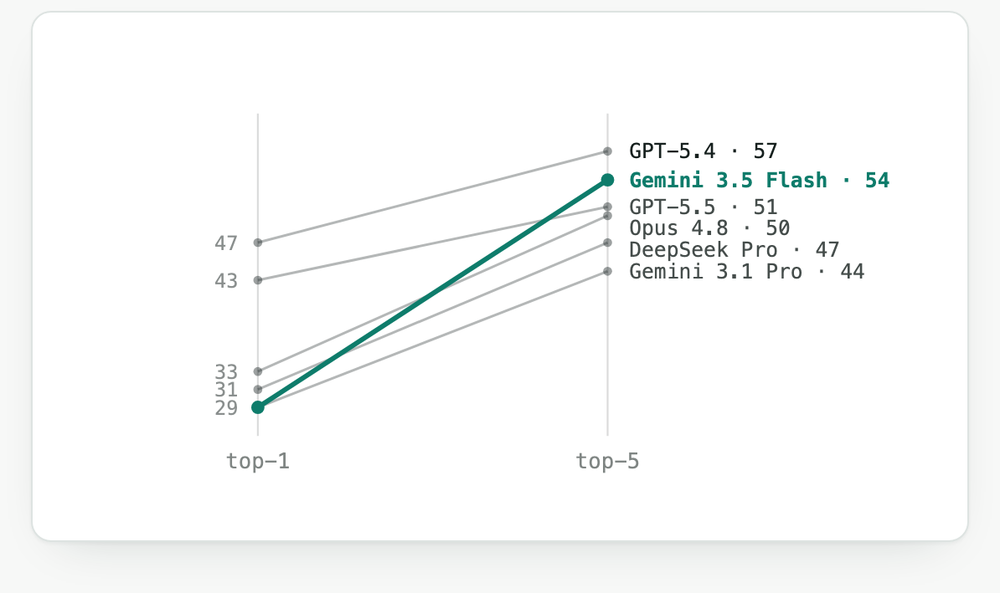

# My [failed] Attempt at making a Medical Diagnostic LLM Harness and Benchmark

*This is a paused, exploratory project. The code, the 68-case benchmark, and the development cases are all in
this repo.*

I set out to build two tools for clinical AI: an open-ended diagnostic benchmark built from post-cutoff
neurology and psychiatry case reports, and a retrieval harness to ground model differentials in literature. I
knew neither would be trivial; I consider myself to have a deep appreciation for the work that goes into
developing benchmarks for LLMs and harnesses that augment the abilities of LLMs like those from OpenAI, Claude,
Cursor, Perplexity, and especially biomed ones like those from OpenEvidence, Undermind, FutureHouse,
DeepEvidence, Queryome, EvidenceMD, etc. (please let me know if I'm missing any). But going into this project I
had a hope that both might be something that might be easy to start, hard to master. Turned out, both were very
hard to start.

While both proved far harder than anticipated and didn't fully achieve either original goals, the project
uncovered some interesting lessons and dynamics in how frontier LLMs handle real-world clinical reasoning.

Code and benchmark available at
[github.com/Santosh-Gupta/ClinicalOrchestra](https://github.com/Santosh-Gupta/ClinicalOrchestra).

## Why this is a blog post, not a paper

One part I got stuck on was building the benchmark: generating synthetic case challenges.

I couldn't start from an existing dataset. Most ready-made diagnostic case-challenge sets come with licensing
that won't let me use them the way I needed — redistribute them, publish challenges derived from them, or
release the result openly. So I tried to build my own from strictly CC-BY open-access case reports. But those
are case studies, they narrate a patient's clinical course, not case challenges, (like those from the New
England Journal of Medicine) which hand a doctor a limited set of facts that are meant to contain everything
needed to reach the diagnosis.

Using frontier APIs like Claude and GPT, I tried to convert the case studies into case challenges: have the
model read the study and lay out the starting information a doctor would need to reach the diagnosis. It was
much messier than expected. I learned that case studies are written to explain a diagnosis the authors already
have, not to stand as self-contained puzzles. And the tool doing the conversion — plus the check for whether
the result is still solvable — is itself an LLM, so the quality of every challenge is capped or biased by the
model that built it.

### Defining ground truth

Case reports mix high-level syndromes, molecular causes, and management decisions—none of which are equivalent
evaluation targets. If a prompt supports "autoimmune encephalitis," a model shouldn't be penalized for missing
an antibody that only appears later in the text. My rule was strict: maintain the paper's original diagnosis,
add missing context if it makes the case fair, or throw it out.

### Multi-step case auditing

A valid evaluation case must pass four distinct tests:

- Is the gold answer a valid diagnosis?
- Is it supported by the provided text?
- Does the text leak the answer?
- Is the target a diagnosis rather than a cause or treatment?

A failure on any point renders model evaluation useless. Truly validating these criteria requires far more
manual rigor than relying on an LLM to judge solvability.

I don't think it's hopeless, though. Determinacy audits, adversarial leakage checks across three models, and
source-grounded repair-or-drop all measurably helped, and none of them needed a clinician in the loop. I can
see the shape of a version that reaches a fair, self-contained challenge without expert review on every case:
pull from multiple sources, extract against formal diagnostic criteria, and use a stronger independent model as
an adversarial checker. The generation should also be at least semi-automatic and continuously updating —
frontier models' training data will eventually absorb the case studies these challenges are built from, so the
benchmark has to keep producing new versions to stay ahead of the advancing cutoff date.

I just couldn't get there on my own time and API budget. Doing it at the level a paper needs costs real money
and real hours, and I was already deep into both, so I'm pausing here. Though I expect to come back to this
eventually as the price-to-quality ratio of frontier models keeps falling, a construct-and-verify loop that's
too expensive to run at scale today gets cheap enough to be worth another pass. And by releasing this, I'm
hoping to draw out contributions, or ideas from others on how to probe frontier LLMs for diagnostic ability.

With that said, here are some observations and lessons that I found interesting.

## 1 — Gemini 3.5 Flash's performance went from near the bottom to near the top as ranked guesses went from top 1 to top 5

Note: the 68 synthetic case studies I ended up with for this benchmark were those that failed deepseek v4
flash - the assumption was that deepseek v4 flash was an inferior model to the other frontier models, which is
problematic for a paper-worthy benchmark. The better alternative was to just retain case studies where at least
one of the frontier models failed at, but went with the former strategy for the sake of saving money on API
costs. I've also left DeepSeek V4 Flash off the chart below, since grading it on the very cases picked from its
own failures would be circular.

For just considering the top-1 ranked guess for diagnosis, GPT-5.4 led (47 of 68) and Gemini 3.5 Flash sat near
the bottom (29). By top-5, Gemini Flash had climbed to second (54), passing GPT-5.5 (51), Opus 4.8 (50), and
DeepSeek Pro (47), while GPT-5.4 stayed on top (57). The right diagnosis was usually somewhere in Flash's list,
just not its top-1 guess — and no other model moved nearly that far.

*Each line is one model, from its top-1 count (left) to its top-5 count (right), out of 68. A line that rises
steeply means the model often had the correct diagnosis in its list, but not as its first guess — Gemini 3.5
Flash climbs from near the bottom to second.*

Due to the flaws in developing this benchmark, there are limits on how far one can interpret from any phenomena
for this benchmark. Still, perhaps there is some sort of 'vibe' this gives off, and if there's something to
Gemini 3.5 Flash's performance here, maybe it's that some of its clinical abilities are latent.

Two other results I didn't expect. Inside a single family the cheaper model won: Gemini 3.5 Flash beat 3.1 Pro
by ten points at top-5. And the older GPT-5.4 came out ahead of the newer 5.5. But again, this isn't an
iron-clad benchmark, so there's a limit to how much can be interpreted from these results.

## 2 — Developing a retrieval harness to assist a closed-book (no internet access) LLM api is much harder than I anticipated

I attempted to create a retrieval harness for LLM apis that don't have access to the internet. There are
versions that do have access to the internet, but are more expensive. There are several search APIs, such as
the one from PubMed, which are cheap or even free. I figured I could put together a harness that might be able
to perform as well as the internet-search APIs, and maybe, outperform them.

It didn't go as planned: handing the model a retrieval-grounded differential in place of its own lowered
accuracy. Retrieval pulls in candidates that are prominent in the literature, floats them toward the top, and
pushes the model's own correct answers down.

That exposed a distinction I had been missing: retrieval and selection are different problems. The system often
retrieved the right disease and placed it somewhere in the top five, then the final chooser ranked a rarer,
more specific, or more paper-salient mimic above it.

Benchmark-mode retrieval was also artificially harder than real clinical retrieval. In a real research
assistant, if the most relevant paper is the exact case report, reading it is the point. In a benchmark, that
is cheating, so the harness had to exclude the source article by DOI, PMCID, and title. That creates a hole
exactly where the strongest evidence often lives: the system has to retrieve around the original paper, infer
the relevant diagnostic pattern from neighboring literature, and still avoid copying source-adjacent phrasing.
That is a much harder task than "use PubMed to help diagnose this case."

I also created a pipeline for the APIs to self reflect on cases it got wrong, where it went wrong, and suggest
rules for the harness so that it wouldn't make that mistake in the future. However, these rules would interfere
with other case challenges. For example, rules that were added to catch missed neuroinflammatory disease,
venous thrombosis, infection, or organic psychiatric mimics became anchors, and the harness kept pushing for a
more exotic answer. tldr; A workflow tuned on one model's failures can become an adversarial prompt for a
better one.

What helped was retrieving less: keep the model's confident top four, and let retrieval touch only the fifth
slot — and only to add a diagnosis the model had missed entirely. Though, I think this is more of a scoring
hack rather than something that meaningfully increases a model's diagnostic ability.

*The final top-5. The model's own top four pass through untouched; retrieval can reach only the fifth slot, and
only to add something the model left out — so it can help without pushing a correct answer down.*

## 3 — A checker can't help if it makes the same mistakes

My next idea was the opposite of adding retrieval. Instead of replacing the model's answer, I let the harness
act as a careful editor. It kept the model's ranked list of diagnoses and only moved one up or down when it
could point to a specific fact in the case that justified the move — a lab value, an imaging finding, something
concrete.

It still couldn't reliably beat the plain model on the hard cases. Looking at the failures showed why: the
editor sometimes took a diagnosis that was actually correct and pushed it down the list, using reasoning that
sounded medically sound but was wrong for that case.

Here is a clear example. Gitelman syndrome is a kidney disorder that usually causes low blood magnesium. In one
case, the magnesium reading did not look low, so the model decided "then it can't be Gitelman" and moved it
down the list. But the correct answer was Gitelman. The Claude-suggested rule (from a different synthetic case
challenge failure) the model used — "Gitelman means low magnesium" — is real, but it does not hold in every
case, and here it threw away the right answer.

I tried the obvious fix: have the model check its own edits before accepting them. It barely helped. The model
that proposed moving Gitelman down was the same model asked to approve that move, so it just agreed with
itself. A checker is only useful if it can be right when the thing it is checking is wrong. This checker had
the same blind spot as the original answer, so it repeated the mistake instead of catching it.

It seems like there's a fundamental limitation when trying to apply recent AI self-correction techniques like
those used in formal mathematics, to clinical reasoning. In math or software verification, a model's proposal
is verified by a deterministic engine like Lean or a compiler. The checker operates on strict formal logic; it
doesn't share the LLM's probabilistic biases, and its output is ground truth. A proof either holds or it
doesn't.

On the other hand, clinical data is messy, incomplete, and uncertain. A counter-indicative lab value or
atypical presentation isn't a hard mathematical invalidation; it's merely a weighted piece of evidence.
Evaluating whether an atypical finding invalidates a candidate diagnosis requires the exact same nuanced
clinical judgment that the primary model failed to exercise in the first place.

## Even with useful signal, I couldn't trust the scores

I think this is the most obvious limitation to developing the harness. So I can change something and check
whether the score went up, but that only works if I trust the score. The benchmark was not good enough to rank
the models for real, but it did seem good enough to show whether a change helped or hurt — so tuning against it
seemed worth trying. It was not that simple.

The "correct" answers were sometimes debatable. The cases were written by a language model and hand-picked for
being hard, and on some of them even the labeled answer is arguable, like the Gitelman case, where a value in
the prompt really does point away from the "correct" diagnosis. So when a change moved the score up by two, I
often could not tell whether it was a real improvement or just an accident of a shaky answer key.

Not gonna lie, I attempted some pretty hacky workarounds like combining two answers, the model's own list and
the harness's version, and I needed a fair way to score the result. The tempting method was, for each case, to
take whichever of the two ranked the right answer higher. But that uses the answer key to make the choice,
which you cannot do in real use, where you do not know the right answer. The honest method is a fixed rule that
does not look at the answer: always use the harness's addition in the fifth slot, whether or not it helps. The
gap between those two scores is the part of the "improvement" that was never real.

Changing the harness often changed the question I was asking. The plain model gives one confident diagnosis.
The harnessed model was asked for five specific, cited diagnoses after reading a page of evidence. Those are
different tasks, so part of what looked like the harness helping was really just the different instructions. To
compare fairly, the baseline has to be the model's own ranked list, judged the same way — not a reworded or
re-collected version that quietly drops good answers.

The harness was hard to get right, and the scoring made it harder. The first version made every model worse;
about ten to twelve points lower at the top-5 mark, and it took several rewrites just to get back to doing no
harm. Then I found that the scores themselves were unstable: grading the same list of diagnoses twice gave
different ranks, so the grader's own randomness was inventing gains and losses. For a while I could not tell
whether I was fixing the harness or fixing the way I measured it. One detail made this worse: every model call
ran at a setting called "temperature zero," which is supposed to make the output the same every time. It was
not. Running the same request on a provider's servers can shuffle small numerical details enough to flip a
close ranking, so running it again never settled anything.

Other failures were ordinary bugs that were easy to miss. A cut-off model response could turn into an empty
search plan. An empty plan could leave the model's protected original answer unprotected. A reading error could
drop a paper from the evidence. A restarted run could lose saved baseline numbers. A rate-limit error could
quietly change how many cases were counted. Every one of these still produced a results file that looked
completely normal.

The lesson: you have to be able to see exactly what the system did. Every dropped document, every fallback,
every cut-off response, every version change, every skipped case, and the exact number of cases counted all
have to be recorded, and the run has to stop loudly when something goes wrong. Otherwise the system can report
an improvement that never happened.

Every part of my setup was one of these same language models, the one that wrote the cases, the one that graded
them, and the one that was supposed to check the edits. They tend to make the same kinds of mistakes at the
same time. So I could never cleanly separate "the harness got better" from "the measurement moved."

*In formal math, a model's proof is checked by Lean, which is always right. In diagnosis, the benchmark, the
grader, and the checker are all LLMs, with nothing guaranteed-correct underneath.*

In math, the whole system rests on Lean, a checker that is always right. In diagnosis, the benchmark, the
grader, and the checker are all language models, with nothing guaranteed-correct underneath.

The tools I used to measure progress had the same weaknesses as the thing I was trying to improve, and there
was no solid, always-correct foundation anywhere to tell me whether I was really making things better.

## What's still unsolved

- **Building fair test cases without the circular problem.** How do you turn a case report into a fair,
  self-contained challenge when the tool building the challenge is a language model with its own blind spots?
  Possible directions: pull from several sources, check each case against formal diagnostic criteria, or bring
  in a human expert at scale.
- **A reliable way to check a diagnosis.** Is there anything that can play Lean's role for medicine, even
  partly — formal diagnostic criteria, normal lab ranges, or a second, stronger model used only as a checker —
  good enough to make an editing harness safe? A model checking its own work is not enough.
- **Scoring the whole ranked list, not just the top answer.** Reading all five guesses instead of only the
  first showed differences between models that a single-answer score hides. That part seems worth keeping no
  matter what happens to the rest.
- **Picking hard cases without tying them to one model.** A set built from one model's mistakes is fine for
  studying those mistakes, but it cannot rank models fairly. A stronger version would choose hard cases by some
  measure that does not depend on one model, and report the model-picked cases separately.

## What's in the repo

- `benchmark/neuro_psych_68_challenges.jsonl` — the 68 test cases. All were published after the tested models'
  training cutoff, all are CC-BY licensed, and all were chosen because DeepSeek Flash got them wrong. Good for
  studying failures, not for ranking models.
- `benchmark/development_cases_359.jsonl` — 358 earlier cases I used while building the harness, each tagged
  with how far it got through review. Not all of these were checked or cleaned — treat them as raw material,
  not a finished benchmark.
- The harness code (`src/clinical_harness/`), the conservative "fifth-slot only" version that does no harm
  (`scripts/fuse_harness.py`), the paused editor version (`src/clinical_harness/harness_v2/`), and the rough
  draft of the technical report (`docs/technical_report/`).

There were a few reasons why I wanted to write this blog. First, I think the failures of developing the
harness, although they are failures, were super interesting to me, so I wanted to put these out there, in the
off chance that anyone else found them interesting. Though, an unexpected benefit - in writing everything down
and thinking/mapping through the project, I've had a few epiphanies. Hopefully there will be a part 2 for this
blog.

Repo: github.com/Santosh-Gupta/ClinicalOrchestra
