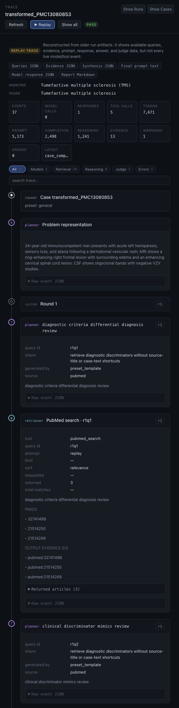

# ClinicalHarness Viewer

A Codex / Claude-Code-style UI for **watching a diagnosis run unfold** — the
clinical reasoning, query planning, literature retrieval, evidence synthesis,
final diagnosis, and, when an expected answer is supplied, the judge's verdict
— as a streaming agent trace.

<a href="assets/clinical-viewer-trace.jpg">
  
</a>

<sub>Click the screenshot to view it full size.</sub>

<details>
<summary>Detailed trace screenshot with expanded cards</summary>

<a href="assets/clinical-viewer-trace-tall.jpg">
  
</a>

</details>

> **Status: MVP plus native event ledgers.** It reconstructs timelines from the
> artifacts a finished run leaves in `runs/<run>/` and can "replay" them
> event-by-event. `retrieval_guided_eval` now also writes
> `<case>.events.jsonl` and accepts an optional `emitter` callback. The backend
> can ingest live events and stream active cases over SSE; the UI discovers
> active/live-only cases, watches selected live traces automatically, and labels
> every timeline as native, live, or replay reconstruction.

```
viewer/
├── ARCHITECTURE.md         # the full design + advanced roadmap
├── REVIEW_HANDOFF.md       # checklist for external LLM/code review
├── backend/                # FastAPI: reads runs/, serves the unified Event stream
│   └── clinical_viewer/
│       ├── events.py       # ★ the unified Event schema (the contract)
│       ├── runs.py         # discover runs & cases on disk
│       ├── app.py          # HTTP + SSE routes
│       └── adapters/
│           ├── replay.py   # ★ artifacts → events (the MVP data path)
│           └── live.py     # event-bus stub for future live streaming
└── frontend/               # Vite + React + TypeScript
    └── src/
        ├── types.ts        # mirror of events.py — keep in sync
        ├── api.ts          # typed client + SSE subscription
        ├── edition.ts      # public vs advanced viewer edition switch
        ├── App.tsx         # public demo + advanced trace shell
        └── components/EventCard.tsx  # per-event-type renderers
```

## What it shows

The advanced local UI uses three panes, like an agent-trace IDE:

1. **Runs** — every directory under `runs/`, with pass/fail tallies.
   Runs with native event ledgers show trace counts; active live cases and
   growing incomplete traces are badged. Viewer-generated runs under
   `viewer/user_generated/runs/` appear here too.
2. **Cases** — each case in a run, with its judged score, expected diagnosis,
   native event count, and live/growing status.
3. **Trace** — the reconstructed timeline: problem representation → per-round
   query planning → retrieved papers → evidence synthesis/discriminators →
   final prompt/injected packet → visible model API response → final diagnosis
   → judge verdict. Click a card to expand it; hit **Replay** to stream the
   events in one at a time. PubMed retrieval and PMC full-text fetches appear
   as first-class `tool_call` cards with query parameters, translated PubMed
   query, returned PMIDs/PMCIDs, output evidence IDs, and returned article
   summaries. Use the trace filters to isolate model calls, retrieval,
   reasoning, judge events, warnings/errors, or search across titles,
   summaries, prompts, and payloads. The trace header summarizes event count,
   model-call count, model-response count, tool-call count, returned total,
   prompt, completion, and reasoning tokens, retrieved evidence count,
   warnings/errors, and the latest event type. It also labels the trace source:
   **native trace** for `<case>.events.jsonl`, **live trace** for active ingest,
   or **replay trace** for older artifact reconstruction.

The public hosted UI is deliberately simpler:

1. **New Case first.** The left Runs and Cases panels are removed. A prominent
   **New Case** button lives in the main panel.
2. **Minimal case form.** Visitors paste de-identified case text and may
   optionally provide a correct answer for benchmarking. Title, answer aliases,
   dry-run, model, retrieval, and judge controls are hidden. PubMed retrieval is
   always requested from the public form; the backend still enforces whether
   retrieval is allowed by environment configuration.
3. **Split trace lanes.** The trace body is split into **Retrieval** on the left
   and **Reasoning** on the right. Query planning, PubMed/PMC calls, and
   evidence events appear in Retrieval; case setup, problem representation,
   prompt assembly, model calls/responses, synthesis, final answer, save status,
   and completion appear in Reasoning.
4. **Working indicators.** A dynamic working banner appears near the top of the
   trace and another appears at the bottom of the Reasoning lane until the
   run emits `case_completed`, so long model calls after prompt assembly do not
   look stalled.

If no correct answer is supplied, the run is treated as **unscored**. The saved
trace still includes the model answer and artifacts, but the harness does not
compare the answer to `"unknown"` and the viewer does not emit a misleading
judge failure.

The expanded prompt/model cards expose the raw final prompt, parsed case packet,
finalization gates, blocked retrieval shortcuts, injected evidence synthesis,
retrieved evidence, screened evidence notes, model name, latency, token usage
when returned by the provider (including cache hit/miss and reasoning-token
details where available), parsed answer JSON, raw model text on parse failures,
and the raw API response. It does not invent hidden chain-of-thought; only
returned model content and structured harness reasoning artifacts are shown.

Evidence cards expose retrieval provenance where available: evidence id, source
query id, rank, source API/scope, relevance score, PMID/PMCID/DOI, publication
types, exclusion reason, abstract snippet, and full-text snippet.

Every expanded event card also includes a collapsed **Raw event JSON** drawer so
reviewers can inspect any payload fields that do not yet have a specialized UI.
When disk artifacts exist, the trace header shows file chips for the raw event
ledger, queries, evidence, synthesis, final prompt, model response, and report;
each chip opens an in-app artifact viewer with the raw content and a direct link
to the corresponding allowlisted backend endpoint. For deterministic `case run`
outputs, the viewer also opens the root ledger artifacts: `events.jsonl`,
`queries.jsonl`, `evidence.jsonl`, `answer.json`, and `manifest.json`.

New live traces also emit `tool_call` cards for PubMed searches, PMC full-text
fetches, and `model_call` cards for each final-answer sample and for optional
subagents: evidence distillation, paper screening, initial clinical assessment, differential
reranking, judged self-consistency clustering, and judge-equivalence calls. Each
card includes the prompt, visible response, parsed JSON when available, latency,
token usage when returned, and raw API payload.

New retrieval-guided runs write `*.events.jsonl`, which the viewer uses as the
authoritative trace. Older rich runs (those produced by
`benchmark retrieval-guided-eval`, which write `*.queries.json`,
`*.evidence.json`, `*.synthesis.json`, `*.retrieval_response.json`) are still
reconstructed from artifacts. Simpler deterministic `case run` outputs are
reconstructed from their root `events.jsonl` ledger. Results-only runs degrade
gracefully to the case → rounds → judge skeleton.

## UI guide

The advanced viewer is organized around a reviewer workflow:

1. **Pick a run.** The left rail lists discovered run directories, case counts,
   pass/fail tallies, live traces, and native event-ledger counts.
2. **Pick a case.** The cases panel shows the expected diagnosis, judge status,
   live/growing state, and event count when a native trace exists.
3. **Read the trace.** The main pane shows the diagnosis attempt as an ordered
   event stream. Cards are collapsed by default with high-signal summaries; open
   a card to inspect details and raw event JSON.

Useful controls:

- **Replay** streams the current timeline event-by-event for the unfolding
  agent-trace effect.
- **New** opens a form for a brand-new de-identified case. The viewer writes a
  one-case manifest under `viewer/user_generated/cases/`, runs it in the
  background, and displays the generated run in the normal Runs/Cases/Trace
  panels. Dry run is on by default; enable PubMed retrieval and model/judge calls
  only when the relevant API environment is configured.
- **Show all** restores the full trace after replay or filtering.
- **Expand all** and **Collapse all** open or close every detailed card in the
  current trace.
- **Export MD** downloads the currently visible trace events as a local Markdown
  file.
- **Save** writes a backend-generated bundle under
  `viewer/user_generated/traces/<run>__<case>__<timestamp>/`. Each bundle
  contains `trace.json` for downstream optimization/evaluation systems and
  `trace.md` for human review. The JSON includes the correct answer as
  `correct_answer` when the run has one, plus model diagnosis, score, artifacts,
  and every normalized event payload. `viewer/user_generated/` is git-ignored.
- **Hide** in the Runs or Cases panel collapses that side panel so the trace can
  use more of the window. **Show Runs** and **Show Cases** restore hidden panels
  from the trace header.
- **Trace filters** isolate model calls, retrieval events, reasoning events,
  judge events, or errors. The search box matches event titles, summaries,
  prompts, and payload text.
- **Artifact chips** open raw run files in-app: event ledgers, queries, evidence,
  synthesis, final prompt, model response, reports, and deterministic-run
  ledgers where present.

In the public edition, the same trace cards and save/export controls are
available, but the navigation is flattened into the main workspace and the trace
is split into Retrieval and Reasoning lanes for easier demo viewing.

How to read the cards:

- **Problem representation** shows the compact clinical framing the harness used
  before retrieval.
- **Query generated** cards show the exact literature-search strings and intent.
- **Tool call** cards show PubMed/PMC calls, returned identifiers, output
  evidence IDs, and article payloads.
- **Evidence** cards show provenance, relevance, source scope, exclusion status,
  abstract snippets, and full-text snippets when available.
- **Synthesis** cards show discriminators, uncertainty, and whether more
  retrieval was requested.
- **Prompt/model cards** show the final injected prompt packet, visible model
  response, parsed JSON, token usage, latency, and raw API payloads when saved.
- **Answer/judge** cards show the final diagnosis and scoring verdict.

The viewer deliberately shows only returned model content and structured harness
reasoning artifacts. It does not fabricate hidden chain-of-thought.

## Run it

The harness package itself is stdlib-only by design; the viewer keeps its own
dependencies isolated so it never pollutes that.

### Prerequisites

- Python 3.11+
- Node 18+ (Vite 5 requirement). **Note:** this machine shipped with Node 14 and
  a broken Homebrew, so a known-good Node 20 was vendored to
  `viewer/.toolchain/` (git-ignored). Use it via:
  `export PATH="$(pwd)/viewer/.toolchain/node-v20.18.1-darwin-arm64/bin:$PATH"`
  — or install a system Node 18+ and ignore the toolchain dir.

### Backend (terminal 1)

```bash
cd viewer/backend
python3 -m venv .venv && . .venv/bin/activate
pip install -e .
python -m clinical_viewer            # serves http://127.0.0.1:8000
# point at a different runs dir:  CLINICAL_HARNESS_RUNS=/path/to/runs python -m clinical_viewer
```

### Frontend (terminal 2)

```bash
cd viewer/frontend
npm install
npm run dev                          # http://localhost:5173 (proxies /api → :8000)
```

Open http://localhost:5173.

## Host a Demo

The repo includes a production Docker path for hosting the viewer as one web
service: the Docker build compiles `viewer/frontend`, installs the harness plus
`viewer/backend`, and serves the React app and `/api/*` from FastAPI.

The hosted Docker build sets `VITE_VIEWER_EDITION=public`. Public edition keeps
the new-case form focused on entering case text plus an optional correct answer.
It hides title, answer aliases, model, judge, retrieval, and dry-run controls
even if backend model env vars exist. Local frontend development defaults to
the advanced edition. To preview either edition locally:

```bash
VITE_VIEWER_EDITION=public npm run build
VITE_VIEWER_EDITION=advanced npm run dev
```

### Render

1. Push this repo to GitHub.
2. In Render, create a **Web Service** from the GitHub repo using the Docker
   runtime, or create a Blueprint from `render.yaml`.
3. Keep the health check path at `/api/health`.
4. If using Docker service fields manually, leave the build context as `.`, set
   the Dockerfile path to `./Dockerfile`, and leave the registry credential
   empty for a public GitHub repo.
5. Open the deployed service URL. The root path serves the viewer; `/api/health`
   reports backend health and demo capabilities.

The checked-in `render.yaml` defaults to a locked-down public service:

- `CLINICAL_VIEWER_ALLOW_RETRIEVAL=false` blocks public PubMed calls.
- `CLINICAL_VIEWER_ALLOW_MODEL_RUNS=false` blocks model calls.
- Generated cases, trace exports, and run outputs are written under
  `/data/user_generated` inside the service filesystem.

The current public demo experience is intended to run retrieval and model calls
when you explicitly enable them in Render. Set these environment variables:

```text
CLINICAL_VIEWER_ALLOW_RETRIEVAL=true
CLINICAL_VIEWER_ALLOW_MODEL_RUNS=true
NCBI_EMAIL=you@example.com
NCBI_API_KEY=optional_ncbi_key
DEEPSEEK_API_KEY=...
DEEPSEEK_BASE_URL=https://api.deepseek.com
DEEPSEEK_MODEL=deepseek-v4-flash
```

The model client also accepts `OPENAI_API_KEY`, `OPENAI_BASE_URL`, and
`OPENAI_MODEL` as OpenAI-compatible fallbacks.

Only enable model calls on a public demo if you are comfortable with visitors
using the configured API budget. Cases submitted through the public UI should be
de-identified.

## API surface

| Method | Path | Returns |
| --- | --- | --- |
| GET | `/api/health` | service + runs-dir status |
| GET | `/api/runs` | `RunSummary[]` |
| GET | `/api/runs/{run}/cases` | `CaseSummary[]` |
| GET | `/api/runs/{run}/cases/{case}/timeline` | `CaseTimeline` |
| GET | `/api/runs/{run}/cases/{case}/stream?delay_ms=` | SSE `Event` stream |
| GET | `/api/runs/{run}/cases/{case}/artifacts/{name}` | raw artifact text |
| POST | `/api/runs/{run}/cases/{case}/save` | user-generated `trace.json` + `trace.md` bundle |
| POST | `/api/new-case` | create a viewer-generated case and start a background run |
| POST | `/api/live/events` | publish one live `Event` |
| POST | `/api/live/close` | close a live stream without a terminal event |

The OpenAPI spec is at `/docs` (Swagger) and `/openapi.json`.

## Live Event Ingest

The harness stays stdlib-only. To watch a CLI run live, pass an emitter that
POSTs each Event-shaped dictionary to the viewer backend:

```python
import json
import urllib.request


def viewer_emitter(event: dict) -> None:
    request = urllib.request.Request(
        "http://127.0.0.1:8000/api/live/events",
        data=json.dumps(event).encode("utf-8"),
        headers={"Content-Type": "application/json"},
        method="POST",
    )
    urllib.request.urlopen(request, timeout=2).close()
```

Then call `run_retrieval_guided_manifest_eval(..., emitter=viewer_emitter)`.
The existing `/stream` endpoint will use live events while the case is active
and fall back to disk replay afterward.

From the CLI, pass the viewer backend URL directly:

```bash
clinical-harness benchmark retrieval-guided-eval \
  --manifest runs/your_manifest.jsonl \
  --out-dir runs/live_test \
  --case-id your_case_id \
  --viewer-url http://127.0.0.1:8000
```

The viewer is observational. If the backend is unavailable, the run continues
and writes the normal artifacts plus `<case>.events.jsonl`.

## For the next agent

Read [ARCHITECTURE.md](ARCHITECTURE.md) and
[REVIEW_HANDOFF.md](REVIEW_HANDOFF.md). The highest-value next step is no
longer basic live discovery; it is richer trace semantics and control-plane
work. Useful directions include first-class tool-call events beyond PubMed
search, side-by-side comparison of multiple runs on the same case, and
interactive controls for pausing or steering retrieval. The current run/case
lists already badge live/growing/native-event traces and auto-refresh while a
selected run has active or incomplete traces. Live events posted to
`/api/live/events` are discoverable even before a run directory exists on disk;
once the harness writes `<case>.events.jsonl`, the same case is replayable from
disk as a native trace.
